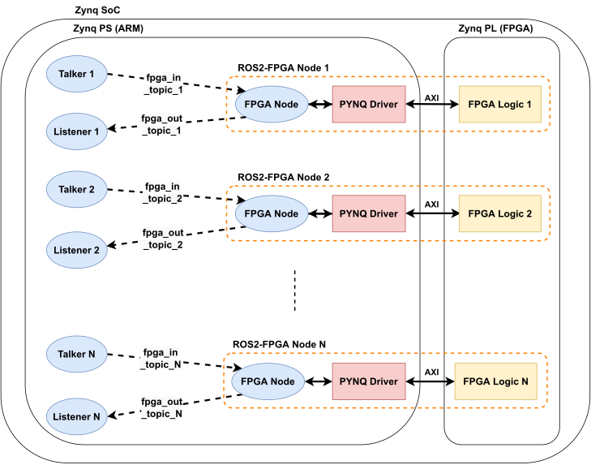

Introduction
========================
meta-FOrEST is an automatic generation tool for ROS 2 nodes integrating multiple FPGA logic into a ROS 2 system (ROS2-FPGA nodes). FPGA and ROS 2 can be used to accelerate calculation processing and improve design productivity. meta-FOrEST supports the PYNQ platform installed on a Zynq SoC. With ROS 2 nodes running on a Zynq SoC, network communication with other machines is possible, facilitating load balancing and parallel processing with FPGA. meta-FOrEST users need only High-Level Synthesis. meta-FOrEST automatically integrates the IP cores into the ROS 2 system.

