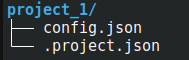
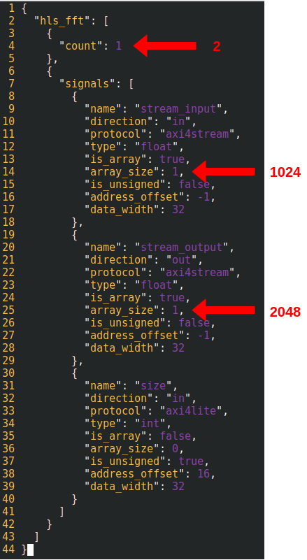
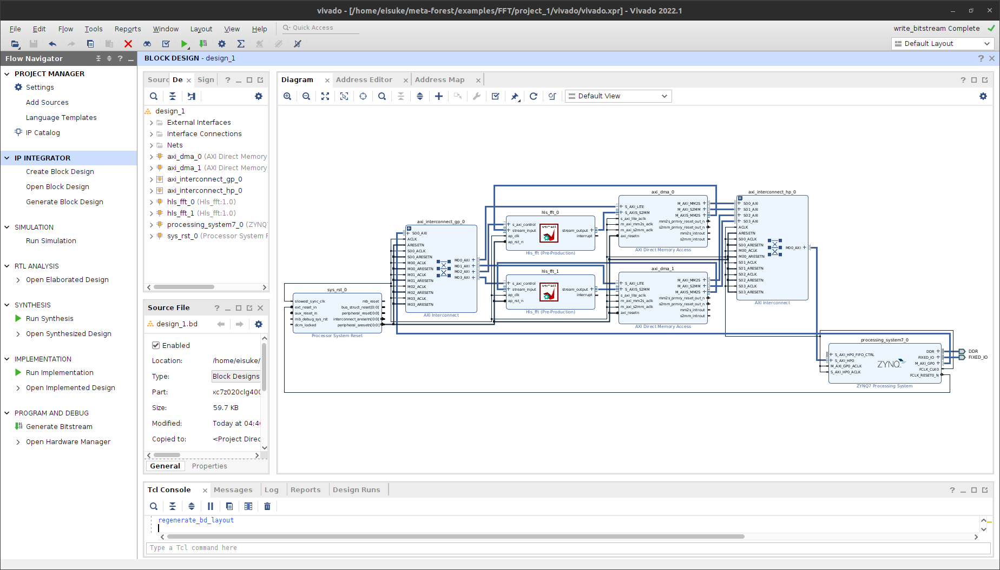
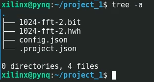
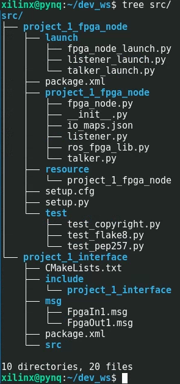
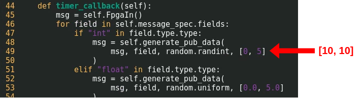
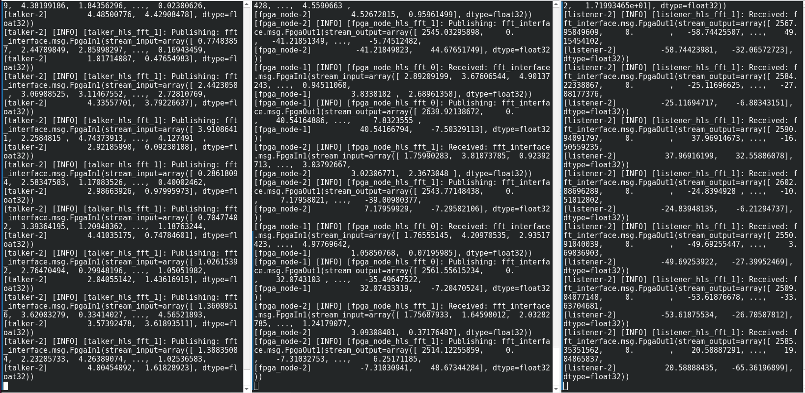
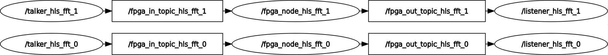

# FFT-ROS2-FPGA Nodes Example
## Overview
This is a meta-FOrEST sample using C++ code that processes FFT using FFT Library.  
The following environments were tested:
- Vivado 2022.1
- Vitis HLS 2022.1
- PYNQ-Z1(xc7z020clg400-1), M-KUBOS(xczu19eg-ffvc1760-2-i)
  - OS: PYNQ v2.5
  - ROS2: eloquent 
## Goal of This Sample
The goal of this sample is to run **two ROS2-FPGA nodes** of 1024-point FFT processing on `PYNQ-Z1`.  

## Preparation
Let's prepare before using meta-FOrEST.  
To use meta-FOrEST, the code to be run as FPGA logic must have done HLS.  
**`In preparation.tcl`, the board parts of `PYNQ-Z1` are set. To target a different board part, change the argument of the `set_part` function in `preparation.tcl`.**  
HLS of C++ code with the following code:
```
vitis_hls preparation.tcl
```
When the process is finished, you will see a directory named `vitis_hls`. There is **no need to do `export RTL`**, which is IP packaging.  

## 1. Make a meta-FOrEST Project!
The meta-FOrEST project is created by hinting at the solution directory of the Vitis HLS project created earlier.  
```
meta-forest init --project project_1 --solution_dir ./vitis_hls/solution1
```
When the command finishes, a directory named `project_1` is created. In the directory, `config.json` and `.project.json` will be created. `config.json` contains the FPGA logic types and address offsets required to create a ROS2-FPGA node. `.project.json` contains information about the meta-FOrEST project.  



## 2. Check and Customize `config.json`
The `config.json` at the time of project creation is shown in the image.  
Since our goal is to create two FFT IP cores and run two ROS2-FPGA nodes, let's set `count` to 2. For a 1024-point FFT, the input is a 1024-element float array and the output is a 2048-element array, so please modify each. See [HLS_FFT](https://github.com/DYGV/HLS_FFT) for detailed design.  



## 3. Generate a Bitstream from meta-FOrEST
Now let's create a block design containing two FFT IP cores. Be sure to change the current directory to the meta-FOrEST project directory. Then use the meta-FOrEST command to generate the block design and Bitstream. Directory named `vivado` is created in the meta-FOrEST project, where the vivado project is stored.  


```
cd project_1
meta-forest gen_block_design
```  
  

Before proceeding to the next step, place the Bitstream and hwh files directly under `project_1`. 
```
cp vivado/vivado.runs/impl_1/design_1_wrapper.bit ./1024-fft-2.bit
cp vivado/vivado.gen/sources_1/bd/design_1/hw_handoff/design_1.hwh ./1024-fft-2.hwh
```  
And, in many cases, it is better to do next step on the FPGA board to avoid version differences.This is an example of using the `rsync` command to transfer only the necessary files to a remote FPGA board: 
```
rsync -arv --exclude '*.log' --exclude 'ip/' --exclude 'vivado/' --exclude '.Xil' ./ xilinx@pynqz1:/home/xilinx/project_1
```
The directory on the remote FPGA when the rsync command finishes is shown in the following image.  
  

## 4. Generate ROS2 Packages for ROS2-FPGA Nodes
Finally, let's generate the package for the ROS2-FPGA nodes on your FPGA board.  

By executing the code below, the code will be generated in the ROS2 workspace as shown in the image.  
```
meta-forest gen_node --bitstream /home/xilinx/project_1/1024-fft-2.bit --ros2_ws /home/xilinx/dev_ws --test
```  
  

If you launch the talker node, there will be no output from the ROS2-FPGA node. This is because the number of FFT points written to the FPGA logic is random.  You need to rewrite the Talker node.
Talker nodes are a bit more complicated because they are made to be somewhat generic.  
In this example, you should change the point of `[0, 5]` to `[10, 10]` in `talker.py` and rebuild ROS2-FPGA package.  

  
  
```
ros2 launch project_1_fpga_node fpga_node_launch.py # as root
ros2 launch project_1_fpga_node listener_launch.py
ros2 launch project_1_fpga_node talker_launch.py
```  
  
It works! 

- Left: Talker node feeding data into ROS2-FPGA node  
- Center: ROS2-FPGA node performing FFT processing  
- Right: Listener node receiving output from ROS2-FPGA node  

  
<br>
  
