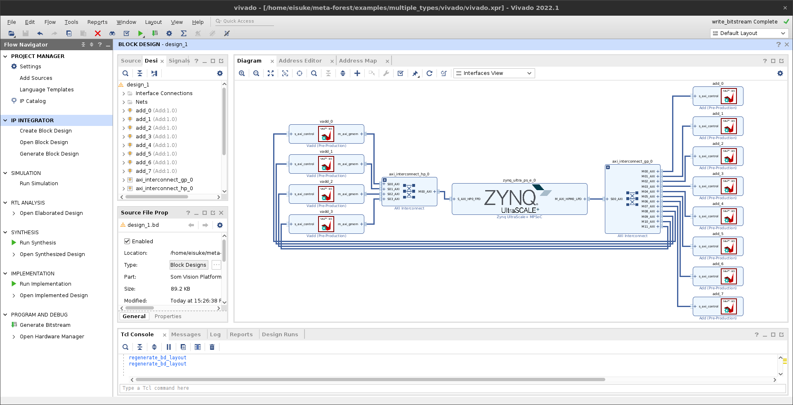
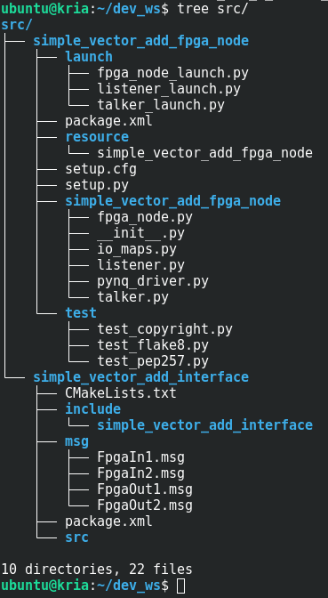
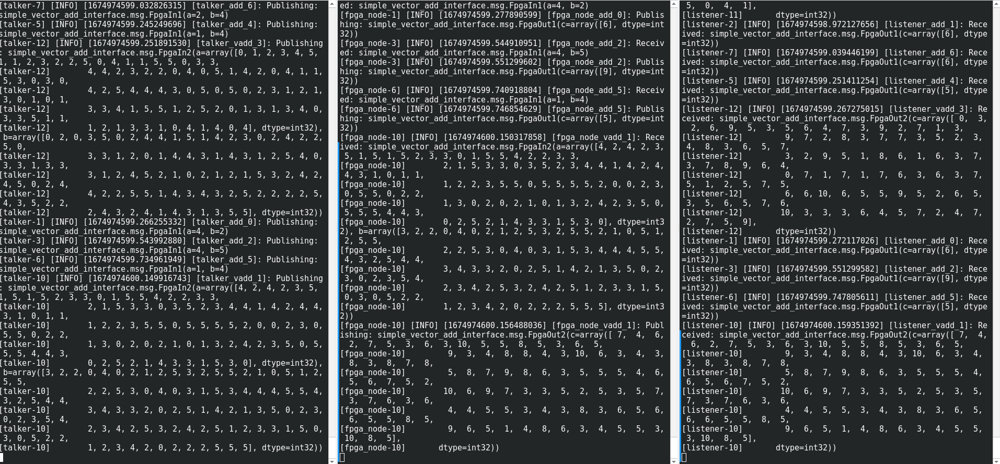
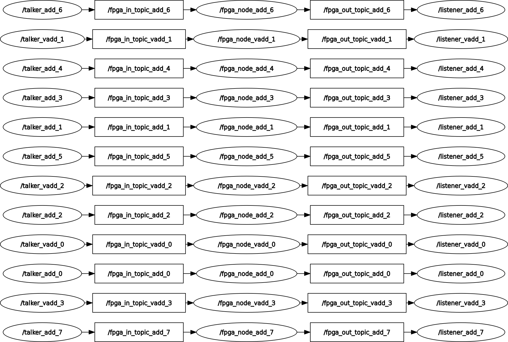

# Multiple Types of ROS2-FPGA Nodes
## Goal of This Sample
The goal of this sample is to run ROS2-FPGA nodes containing multiple types of IP cores. This sample creates a ROS2-FPGA node containing eight [simple-add](../simple-add/README.md) and four [vector-add](../vector-add/README.md).

## Tested Environment
The following environments were tested:
- Vivado 2022.1  
- Vitis HLS 2022.1  
- Kria KR260 (K26 SOM: XCK26-SFVC784-2LV-C)  
  - OS: [Kria-PYNQ v3.0](https://github.com/Xilinx/Kria-PYNQ/releases/tag/v3.0)  
  - ROS2: humble  
  
## Preparation
HLS and IP packaging must be completed before using meta-FOrEST. Please complete  [simple-add preparation](../simple-add/README.md) and [vector-add preparation](../vector-add/README.md). Also note the `set_part` in `preparation.tcl`.

## Vivado Block Design
The current directory must be this directory when creating a block design:
```bash
$ pwd
/home/eisuke/meta-forest/examples/multiple_types
```  
Then, create a block design. target_part should be adapted to your own environment.
```bash
meta-forest gen_bd \
 --target_part xck26-sfvc784-2LV-c \
 --ip_directory ../simple-add/vitis_hls/solution1  \
 --IP add \
 --count 8 \
 --ip_directory ../vector-add/vitis_hls/solution1  \
 --IP vadd \
 --count 4 \
 --step_to write_bitstream
```  

After the block design is created, the vivado directory is created. The block design now looks like this:  
  

## ROS2-FPGA Nodes
The command for gen_node is as follows.
Please adapt to your own environment such as bitstream.
```bash
meta-forest gen_node \
--workspace /home/ubuntu/dev_ws \
--package_name simple_vector_add \
--bitstream /home/ubuntu/dev_ws/simple_add_8_vector_add_4.bit \
--test \
--IP add \
--count 8 \
--in a --in_type int32 \
--in b --in_type int32 \
--out c --out_type int32[1] \
--IP vadd \
--count 4 \
--in a --in_type int32[100] \
--in b --in_type int32[100] \
--out c --out_type int32[100]
```


  

   
  


