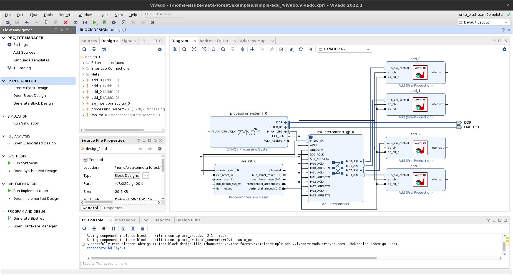
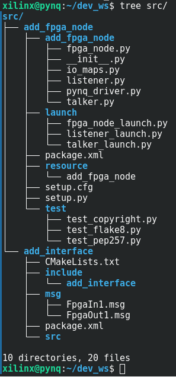
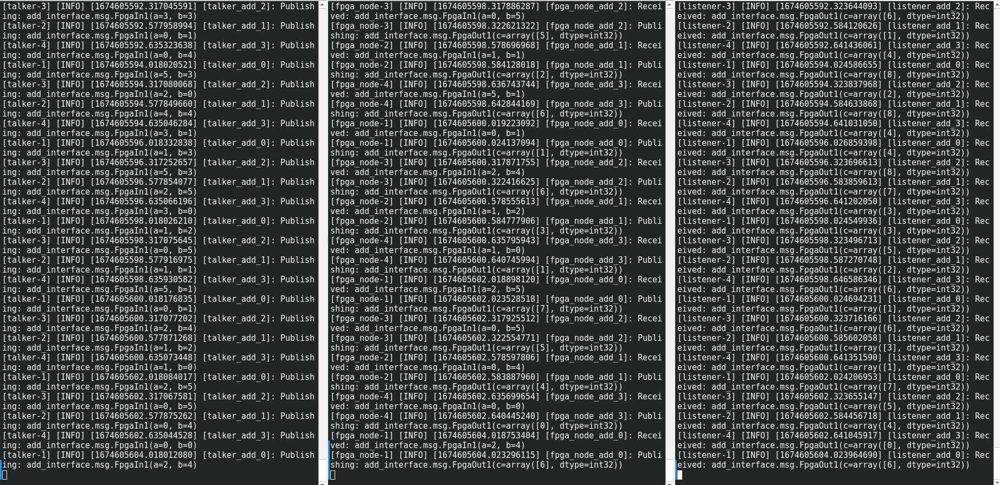

# ADD-ROS2-FPGA Nodes Example
## Goal of This Sample
The goal of this sample is to run **four ROS2-FPGA nodes** of add on `PYNQ-Z1`.  

## Tested Environment
The following environments were tested:
- [x] Vivado 2022.1
- [x] Vitis HLS 2022.1
- [x] PYNQ-Z1(xc7z020clg400-1)
  - OS: PYNQ v2.5
  - ROS2: eloquent 
- [x] M-KUBOS(xczu19eg-ffvc1760-2-i)
  - OS: PYNQ v2.5
  - ROS2: eloquent 
- [x] Kria K260 (K26 SOM: XCK26-SFVC784-2LV-C)
  - OS: [Kria-PYNQ v3.0](https://github.com/Xilinx/Kria-PYNQ/releases/tag/v3.0)
  - ROS2: humble  

## Preparation
Let's prepare before using meta-FOrEST.  
To use meta-FOrEST, the code to be run as FPGA logic must have done `C Synthesis` and `export RTL`.  
**`In preparation.tcl`, the board parts of `PYNQ-Z1` are set. To target a different board part, change the argument of the `set_part` function in `preparation.tcl`.**  
HLS of C++ code with the following code:
```
vitis_hls preparation.tcl
```
When the process is finished, you will see a directory named `vitis_hls`.

## Make a Vivado Block Design with meta-FOrEST!
Please set up the path for Vivado before executing `meta-forest gen_bd` command. In our environment, we set the following.
```
source /tools/Xilinx/Vivado/2022.1/settings64.sh
```

```
meta-forest gen_bd \
 --ip_directory ./vitis_hls/solution1  \
 --target_part xc7z020clg400-1 \
 --IP add \
 --count 4 \
 --step_to write_bitstream
```
 When the process is finished, you will see a directory named `vivado`.  
   
Let's transfer the created bitstream to the Zynq SoC with the following command.  
```
scp vivado/vivado.runs/impl_1/design_1_wrapper.bit xilinx@xxx.xxx.xxx.xxx:/home/xilinx/dev_ws/add_4.bit
scp vivado/vivado.gen/sources_1/bd/design_1/hw_handoff/design_1.hwh  xilinx@xxx.xxx.xxx.xxx:/home/xilinx/dev_ws/add_4.hwh
```  

## Generate ROS2 Packages for ROS2-FPGA Nodes
Finally, let's generate the package for the ROS2-FPGA nodes on your FPGA board.  
Please set up the path for ROS2 before executing `meta-forest gen_node` command. In our environment, we set the following.

```
source /opt/ros/eloquent/setup.bash
```
By executing the code below, the code will be generated in the ROS2 workspace as shown in the image.  

```
meta-forest gen_node \
--workspace /home/xilinx/dev_ws \
--package_name add \
--bitstream /home/xilinx/dev_ws/add_4.bit \
--test \
--IP add \
--count 4 \
--in a --in_type int32 \
--in b --in_type int32 \
--out c --out_type int32[1]
```  
  

  
```
ros2 launch add_fpga_node fpga_node_launch.py # as root
ros2 launch add_fpga_node listener_launch.py
ros2 launch add_fpga_node talker_launch.py
```  
It works!

- Left: Talker node feeding data into ROS2-FPGA node
- Center: ROS2-FPGA node add processing
- Right: Listener node receiving output from ROS2-FPGA node




