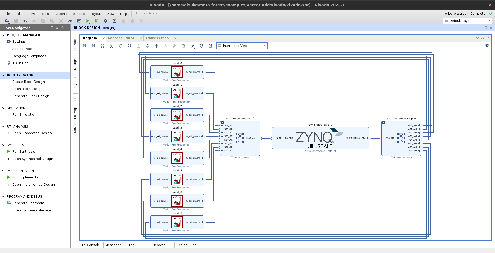
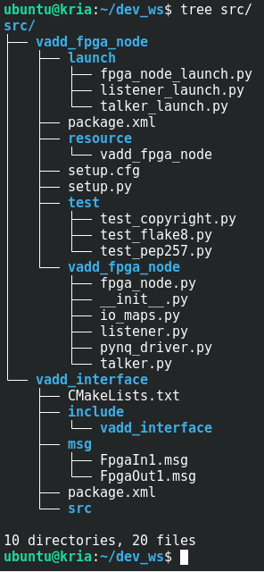
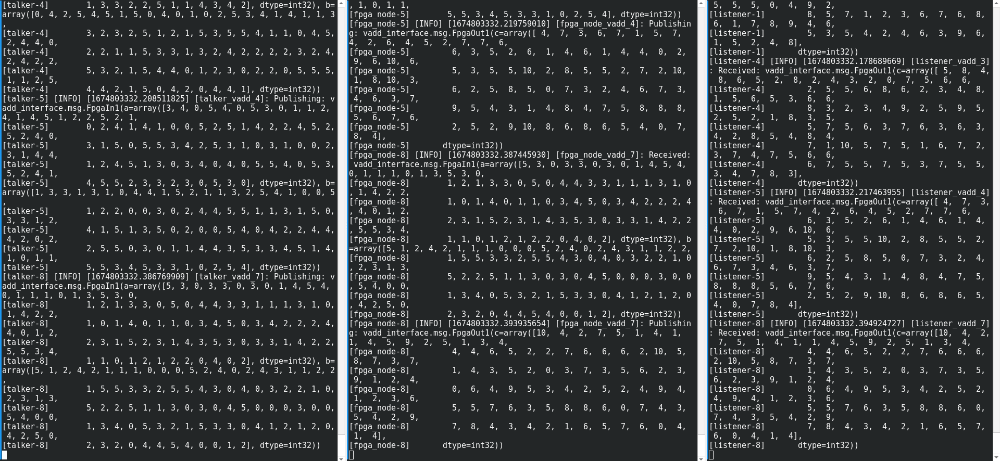

# ROS2-FPGA Nodes Example -vector add-
## Goal of This Sample
The goal of this sample is to run **eight ROS2-FPGA nodes** of vector add on `KR260`. It should work on other boards if you change the target device.

## Tested Environment
The following environments were tested:
- [x] Vivado 2022.1  
- [x] Vitis HLS 2022.1  
- [x] Kria KR260 (K26 SOM: XCK26-SFVC784-2LV-C)  
  - OS: [Kria-PYNQ v3.0](https://github.com/Xilinx/Kria-PYNQ/releases/tag/v3.0)  
  - ROS2: humble  

## Preparation
Let's prepare before using meta-FOrEST.
To use meta-FOrEST, the code to be run as FPGA logic must have done `C Synthesis` and `export RTL`.
In preparation.tcl, the board parts of KR260 are set. To target a different board part, change the argument of the set_part function in preparation.tcl.
HLS of C++ code with the following code:
```
vitis_hls preparation.tcl
```  
When the process is finished, you will see a directory named vitis_hls.

## Make a Vivado Block Design with meta-FOrEST!
Please set up the path for Vivado before executing `meta-forest gen_bd` command. In our environment, we set the following.
```
source /tools/Xilinx/Vivado/2022.1/settings64.sh
```  
You can create a block design with the following command. The parameter values should be adapted to your environment.  
```
meta-forest gen_bd \
 --ip_directory ./vitis_hls/solution1  \
 --target_part xck26-sfvc784-2LV-c \
 --IP vadd \
 --count 8 \
 --step_to write_bitstream
```
 When the process is finished, you will see a directory named `vivado`.  
   
Let's transfer the created bitstream to the Zynq SoC with the following command.  
```
scp vivado/vivado.runs/impl_1/design_1_wrapper.bit ubuntu@xxx.xxx.xxx.xxx:/home/ubuntu/dev_ws/vadd_8.bit
scp vivado/vivado.gen/sources_1/bd/design_1/hw_handoff/design_1.hwh  ubuntu@xxx.xxx.xxx.xxx:/home/ubuntu/dev_ws/vadd_8.hwh
```  

## Generate ROS2 Packages for ROS2-FPGA Nodes
Finally, let's generate the package for the ROS2-FPGA nodes on your FPGA board.  
Please set up the path for ROS2 before executing `meta-forest gen_node` command. In our environment, we set the following.

```
source /opt/ros/humble/setup.bash
```
By executing the code below, the code will be generated in the ROS2 workspace as shown in the image. The `workspace` and `bitstream` value should be adapted to your own environment.  

```
meta-forest gen_node \
--workspace /home/ubuntu/dev_ws \
--package_name vadd \
--bitstream /home/ubuntu/dev_ws/vadd_8.bit \
--test \
--IP vadd \
--count 8 \
--in a --in_type int32[100] \
--in b --in_type int32[100] \
--out c --out_type int32[100]
```  
  

After launch the FPGA node as root user, check if you can see the topics in the `ros2 topic list` in another terminal before launch the Talker/Listener node. If not, you may need to run the Talker/Listener node as root user as well as the FPGA node.  
```
ros2 launch vadd_fpga_node fpga_node_launch.py # as root
ros2 launch vadd_fpga_node listener_launch.py
ros2 launch vadd_fpga_node talker_launch.py
```  
It works!

- Left: Talker node feeding data (input data source) into ROS2-FPGA node  
- Center: ROS2-FPGA node vector add processing  
- Right: Listener node receiving output from ROS2-FPGA node  




